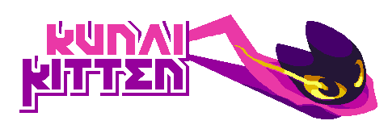
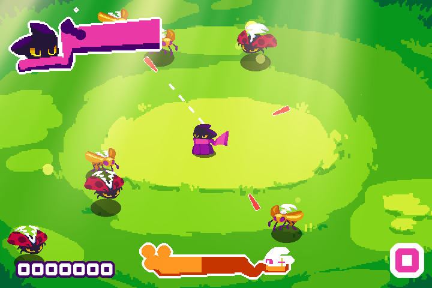

    

<h1 align="center">Kunai Kitten</h1>

    A 1-button shooter shooter 2D game where you're ninja cat Gabi, defending yourself from a
    horde of bugs by throwing knives on them. Made with Godot 3.x and originally submitted to <a href="https://itch.io/jam/1-button-jam-2024" target="_blank">1-Button Jam 2024</a>.

    

    Here's a bit in-depth devlog: <a href="https://dinpixels.itch.io/kunai-kitten/devlog/845033/v0182-first-and-jam-release">https://dinpixels.itch.io/kunai-kitten/devlog/845033/v0182-first-and-jam-release</a>

This project is under the MIT license, while the used third-party assets are under their own third-party licenses (see [Credits](#credits)).

## Table of Contents
- [Gameplay](#gameplay)
- [Features](#features)
- [To-do](#to-do)
- [Tools](#tools)
- [Credits](#credits)

## Gameplay
### Controls
The attack aim rotates on its own, and the player can change its direction as well as attack at the
same time by pressing the spacebar. Tapping it rapidly narrows the aim angles, making it a bit more precise to shoot the enemies.

Getting enough combo allows the use of super/skill by holding spacebar in certain seconds.

### Goals
The goal is to simply eliminate enemies, accumulate enough score to get into the boss fight, and reach the ending by defeating the boss.

## Features
- Spacebar-only controls for both menus and player actions
- AnimationPlayer-limited linear dialogue system
- Super/skill after certain combo
- Score and combo counters
- A simple boss fight via AnimationPlayer
- GLES2 to support low-end devices

## To-do
- [ ] Add load/save system
- [ ] Fix dialogue text's animation
- [ ] Fix super/skill issues
- [ ] Improve Credits scene
    - Add more details about the authors and licenses
    - Use ScrollContainer as parent, that scrolls with spacebar
    - Use the same text format from README.md (or find any 'better' format)

### Tools
- **Aseprite** - animated sprite editor and tool  
[https://www.aseprite.org/](https://www.aseprite.org/)

- **Godot Engine v3.6** - free, open‑source game engine  
[https://godotengine.org/](https://godotengine.org/)

## Credits
Authors, their works, and their own licenses

### Pixel Art, Animation, Code, and 'Plot'
- **Din [(@DinPixels)](https://bsky.app/profile/dinpixels.bsky.social)** - sprites, background, UI textures, © 2024-present

### Music
- **Mushroom Dance** by [bart](https://opengameart.org/users/bart), © 2010-present  
[https://opengameart.org/content/mushroom-dance](https://opengameart.org/content/mushroom-dance)  
Licenses: [CC BY 3.0](https://creativecommons.org/licenses/by/3.0/), [CC BY-SA 3.0](https://creativecommons.org/licenses/by-sa/3.0/), [GPL 3.0](https://www.gnu.org/licenses/gpl-3.0.html), [GPL 2.0](https://www.gnu.org/licenses/old-licenses/gpl-2.0.html)

- **Fun Adventure** by [HitCtrl](https://opengameart.org/users/hitctrl), © 2018-present  
[https://opengameart.org/content/fun-adventure](https://opengameart.org/content/fun-adventure)  
License: [CC BY 3.0](https://creativecommons.org/licenses/by/3.0/)

- **Game Over!** by [zuvizu](https://opengameart.org/users/zuvizu), © 2016-present  
[https://opengameart.org/content/game-over-0](https://opengameart.org/content/game-over-0)  
License: [CC0](https://creativecommons.org/publicdomain/zero/1.0/)

### Shaders
- **Line2D animation** by [cpt_metal](https://godotshaders.com/author/cpt_metal/), © 2024-present  
[https://godotshaders.com/shader/line2d-animation/](https://godotshaders.com/shader/line2d-animation/)  
License: [CC0](https://creativecommons.org/publicdomain/zero/1.0/)

- **God rays** by [pend00](https://godotshaders.com/author/pend00/), © 2021-present  
[https://godotshaders.com/shader/god-rays/](https://godotshaders.com/shader/god-rays/)  
License: [CC0](https://creativecommons.org/publicdomain/zero/1.0/)

- **2D outline/inline, configured for sprite sheets** by [juulpower](https://godotshaders.com/author/juulpower/), © 2023-present  
[https://godotshaders.com/shader/2d-outline-inline-configured-for-sprite-sheets/](https://godotshaders.com/shader/2d-outline-inline-configured-for-sprite-sheets/)  
License: [CC0](https://creativecommons.org/publicdomain/zero/1.0/)

- **Hit Flash Effect Shader** by [triangledevv](https://godotshaders.com/author/triangledevv/), © 2021-present  
[https://godotshaders.com/shader/hit-flash-effect-shader/](https://godotshaders.com/shader/hit-flash-effect-shader/)  
License: [MIT](https://opensource.org/license/MIT)

### Fonts
- **Bit3** by [Camshaft](https://www.fontsc.com/font/designer/camshaft), © 2016-present  
[https://www.fontsc.com/font/bit3](https://www.fontsc.com/font/bit3)  
License: Freeware - Personal & Commercial Use

- **Note:** I can't find the exact fonts and licenses for the following. This needs to be updated.
    - **Elastica** and **Industrial Faith** *provided* by [sadgrl.online]()  
[https://goblin-heart.net/sadgrl/webmastery/downloads/fonts](https://goblin-heart.net/sadgrl/webmastery/downloads/fonts)
